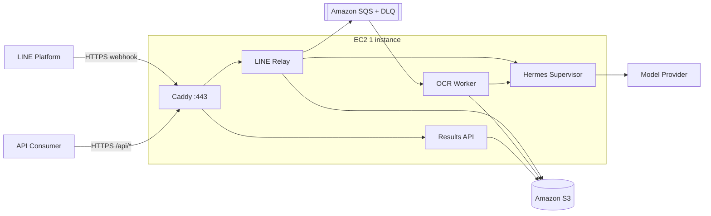
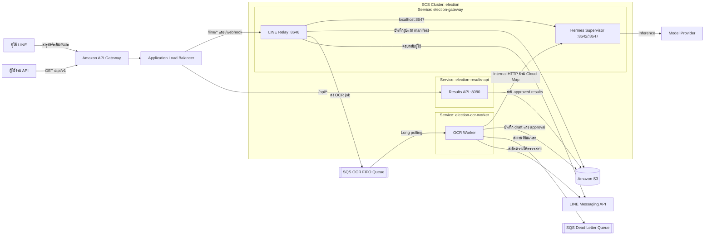
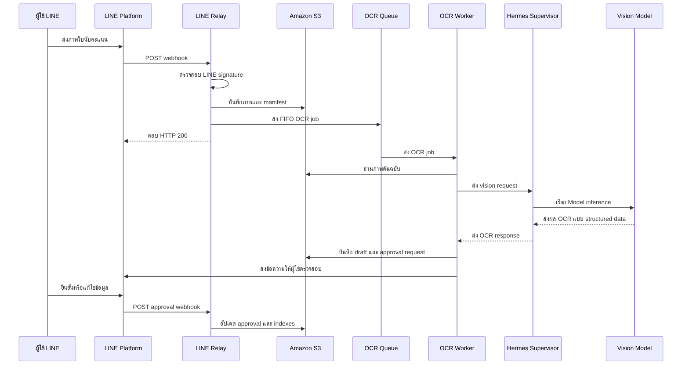
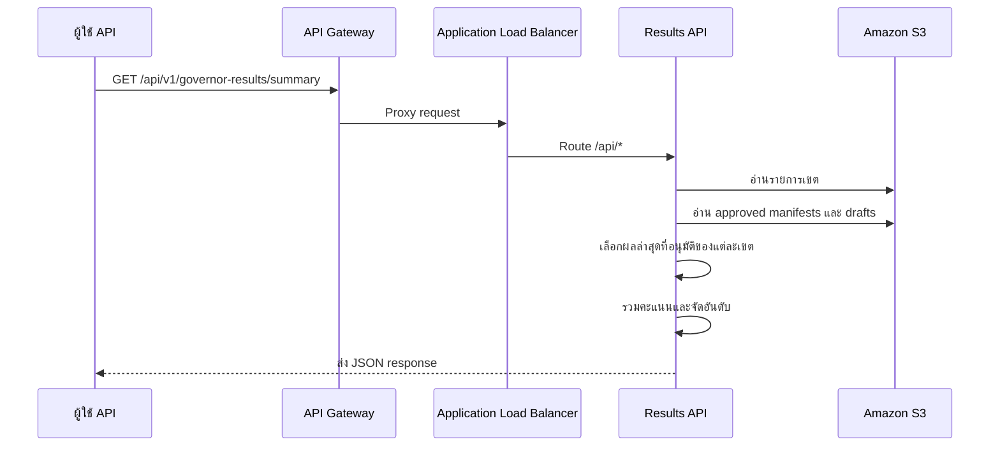
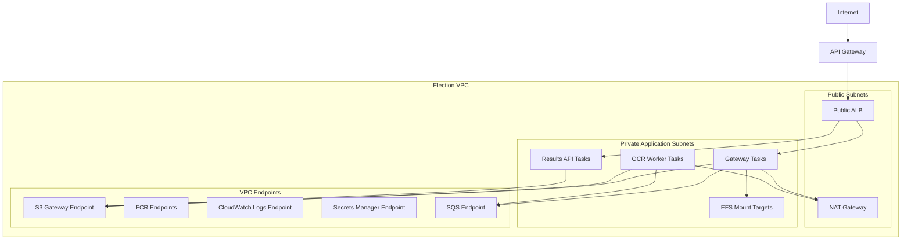

# เอกสารโครงสร้างพื้นฐานระบบ Election Platform

**สถานะ:** เอกสารส่งมอบให้ทีม Infrastructure  
**Region หลัก:** `ap-southeast-1`  
**Runtime ที่แนะนำปัจจุบัน:** EC2 หนึ่งเครื่อง + Docker Compose
**รูปแบบ Deploy บนเครื่อง Local:** `compose.yaml`

## 0. ข้อสรุปสำหรับการ Deploy

ระบบมี Docker image และ `compose.yaml` ที่รันครบทั้ง Hermes Supervisor,
LINE Relay, OCR Worker และ Results API แล้ว แนวทางเริ่มต้นที่แนะนำคือใช้
**EC2 หนึ่งเครื่อง + Docker Compose + Caddy** เพื่อให้ติดตั้งและดูแลง่าย
พร้อมลด AWS services ที่มีค่าใช้จ่ายคงที่



### AWS services ที่ต้องมี

| Service | จำเป็น | เหตุผล |
| --- | --- | --- |
| EC2 + EBS | ใช่ | รัน container ทั้งหมดและเก็บ Hermes runtime |
| Elastic IP | ใช่ | ให้ DNS ชี้เข้าเครื่องเดิมหลัง restart |
| S3 | ใช่ | เก็บรูป, manifest, draft และผลที่อนุมัติ |
| SQS + DLQ | ใช่ | แยก webhook ออกจากงาน OCR และรองรับ retry |
| Route 53 | ไม่บังคับ | ใช้ DNS provider เดิมได้ |
| CloudWatch | ไม่บังคับ | เริ่มจาก Docker logs ได้ แล้วเพิ่มเมื่อจำเป็น |

### AWS services ที่ตัดออกจากแบบเริ่มต้น

- ECS Fargate และ ECR
- Application Load Balancer
- API Gateway
- NAT Gateway
- EFS
- Cloud Map

การตัด service เหล่านี้ลดทั้งค่าใช้จ่ายคงที่และจำนวน resource ที่ทีมต้องดูแล
โดย Caddy ทำ reverse proxy และ TLS บน EC2 ส่วน image build บนเครื่อง EC2
จาก source code ได้โดยตรง

### คำสั่ง Deploy

```bash
cd /opt/election
cp .env.example .env
# ตั้งค่า .env และ DNS ก่อน
chmod +x deploy/ec2/deploy.sh
./deploy/ec2/deploy.sh
```

Production profile จะเปิด Caddy ที่ port `80/443` ส่วน ports ของ service
ภายใน bind ที่ `127.0.0.1` และไม่ควรเปิดใน Security Group

### หลักการเลือก EC2 หรือ ECS

ใช้ EC2 + Compose จนกว่าจะมีเงื่อนไขอย่างน้อยหนึ่งข้อ:

- ต้องการ High Availability หลาย Availability Zones
- ต้อง autoscale OCR Worker ตามจำนวน SQS messages
- ต้อง deploy แต่ละ service แยกกันโดยไม่มี downtime
- เครื่องเดียวมี CPU/RAM ไม่พออย่างต่อเนื่อง
- SLA กำหนดว่าห้ามมี Single Point of Failure

เมื่อเกิดเงื่อนไขดังกล่าวจึงย้ายไป ECS Fargate ตามหัวข้อเดิมในเอกสารนี้
ไม่ควรเริ่มด้วย ECS เพียงเพราะระบบมีหลาย container

## 1. วัตถุประสงค์

เอกสารนี้อธิบาย Infrastructure ปัจจุบัน สถาปัตยกรรมเป้าหมายบน AWS รูปแบบการ
Deploy ขอบเขตด้าน Security การ Scale การดูแลระบบ และแผน Migration สำหรับ
Election Platform

ระบบรับภาพใบนับคะแนนจาก LINE บันทึกข้อมูลต้นฉบับลง S3 ส่งงาน OCR ผ่าน SQS
ให้ผู้ใช้ตรวจสอบและยืนยันผล จากนั้นเปิด REST API สำหรับอ่านผลที่อนุมัติแล้ว

## 2. ส่วนประกอบของระบบ

| Component | หน้าที่ | Protocol | State |
| --- | --- | --- | --- |
| Hermes Supervisor | Model gateway, LINE plugin และ provider configuration | HTTP `8642`, LINE `8647`, dashboard `9119` | Hermes runtime |
| LINE Relay | ตรวจสอบ LINE webhook บันทึกข้อมูล และส่ง OCR job | HTTP `8646` | Stateless |
| OCR Worker | อ่านงานจาก SQS เรียก Hermes และสร้าง draft/approval | SQS และ HTTP | Stateless |
| Results API | อ่านผลที่อนุมัติจาก S3 และเปิด REST API | HTTP `8080` | Stateless |
| Update Worker | ส่งผลไปยังระบบปลายทางเพิ่มเติม เป็น component เสริม | SQS และ HTTP | Stateless |

## 3. สถาปัตยกรรมสำหรับขยายระบบในอนาคต

เมื่อ EC2 เครื่องเดียวไม่เพียงพอ ให้ย้ายไปใช้ **1 ECS Cluster และ 3 ECS Services**

1. `election-gateway`: มี Hermes Supervisor และ LINE Relay อยู่ใน Fargate task เดียวกัน
2. `election-ocr-worker`: OCR Worker แยกเป็น Fargate task
3. `election-results-api`: Results API แยกเป็น Fargate task

OCR Worker และ Results API ต้องแยกจาก Gateway เพราะมีรอบการ Deploy, IAM,
Network, Availability และวิธี Autoscaling ต่างกัน



## 4. สถานะ AWS ปัจจุบัน

ปรับระบบใหม่เมื่อวันที่ 15 มิถุนายน 2026 เป็น EC2 และ Docker Compose:

| Resource | ค่าปัจจุบัน |
| --- | --- |
| EC2 | `i-095a4f631029d80a8` |
| Instance type | `c7i-flex.large` |
| Elastic IP | `47.131.183.28` |
| Public domain ชั่วคราว | `47.131.183.28.sslip.io` |
| Runtime | Docker Compose production profile |
| S3 | `bkk-election-images-party` |
| Deployment bucket | `ch7-election-dev-personal-hermes-2026` |
| OCR Queue | `election-ocr-jobs.fifo` |
| OCR DLQ | `election-ocr-dlq.fifo` |
| Secrets | SSM SecureString `/election/compose-env` |

การ Route ของ Caddy:

| Paths | Target |
| --- | --- |
| `/line/webhook`, `/webhook`, `/line/liff/*` | LINE Relay |
| `/api/*` | Results API |
| `/health` | Caddy health response |

### ความเสี่ยงที่พบ

- EC2 เครื่องเดียวเป็น Single Point of Failure
- Hermes image ยังใช้ tag `latest` ซึ่งเปลี่ยนแปลงได้
- Domain `sslip.io` เป็นชื่อชั่วคราว ควรเปลี่ยนเป็น domain ขององค์กร
- Hermes runtime อยู่บน EBS ต้องตั้งรอบ snapshot
- Deployment artifact ยังสร้างและอัปโหลดด้วยมือ
- Infrastructure ใหม่ยังไม่มี Infrastructure as Code

## 5. ลำดับการทำงานของข้อมูล

### LINE และ OCR



### Results API



## 6. การออกแบบ AWS Resources

### 6.1 Network

ควรใช้อย่างน้อยสอง Availability Zones



ECS Tasks ต้องอยู่ใน Private Subnets และตั้ง `assignPublicIp=DISABLED` โดยมี
ALB เป็น Public resource เพียงจุดเดียว NAT Gateway จำเป็นสำหรับ LINE และ
Model Provider ที่อยู่ภายนอก AWS

### 6.2 Security Groups

| Security group | Inbound | Outbound |
| --- | --- | --- |
| `election-alb-sg` | HTTPS `443` จาก Internet หรือ API Gateway | Relay `8646`, API `8080` |
| `election-gateway-sg` | `8646` จาก ALB และ `8642` จาก Worker SG | HTTPS และ AWS endpoints |
| `election-worker-sg` | ไม่มี | Gateway `8642`, HTTPS และ AWS endpoints |
| `election-api-sg` | `8080` จาก ALB SG | S3 endpoint และ HTTPS |
| `election-efs-sg` | NFS `2049` จาก Gateway SG | Stateful return traffic |

ห้ามเปิด Hermes API `8642` และ Dashboard `9119` สู่ Internet โดยตรง
Dashboard ควรเข้าผ่าน VPN, SSM port forwarding, Internal ALB หรือปิดใช้งาน

### 6.3 Load Balancer

ใช้ HTTPS listener หนึ่งชุดพร้อม ACM certificate

| Priority | Rule | Target group | Health check |
| ---: | --- | --- | --- |
| 10 | `/line/webhook`, `/webhook`, `/line/liff/*` | Relay `8646` | `/line/webhook/health` |
| 20 | `/api/*` | Results API `8080` | `/health` |
| Default | ตอบ Fixed `404` | ไม่มี | ไม่มี |

Default route ไม่ควรส่งไป Hermes โดยตรง

### 6.4 Service Discovery

ลงทะเบียน Gateway task ใน AWS Cloud Map เช่น:

```text
gateway.election.local
```

ตั้งค่า OCR Worker:

```text
OCR_WORKER_HERMES_BASE_URL=http://gateway.election.local:8642
```

หาก Hermes และ Worker อยู่คนละ ECS Service จะใช้ `localhost` เชื่อมกันไม่ได้

### 6.5 Storage

#### Amazon S3

S3 เป็นแหล่งข้อมูลหลักของผลการเลือกตั้ง

```text
messages/{sourceMessageId}/original.bin
messages/{sourceMessageId}/manifest.json
messages/{sourceMessageId}/draft_r{revision}.json
messages/{sourceMessageId}/approval_r{revision}.json
indexes/by-area/{electionId}/{areaId}/submissions.json
```

ข้อกำหนดที่แนะนำ:

- เปิด Block Public Access ทั้งหมด
- เปิด Bucket Versioning
- ใช้ SSE-KMS
- กำหนด Lifecycle สำหรับรูปต้นฉบับและ non-current versions
- เปิด CloudTrail data events เมื่อมีข้อกำหนด Audit
- Bucket policy ต้องปฏิเสธ connection ที่ไม่เข้ารหัส

#### Amazon EFS

Mount EFS ที่ `/opt/data` ของ Hermes เพื่อเก็บ runtime configuration และ state
ส่วน Secrets ยังต้องมาจาก Secrets Manager ไม่ควรเก็บไว้ใน EFS หรือ repository

### 6.6 SQS

ใช้ FIFO queue เพราะระบบมีการ deduplicate และต้องรักษาลำดับของ workflow

| Setting | ค่าที่แนะนำ |
| --- | --- |
| Long polling | 20 วินาที |
| Visibility timeout | มากกว่าเวลาสูงสุดที่ OCR ใช้ |
| Message retention | 4-14 วัน |
| DLQ redrive | 3-5 ครั้ง |
| Encryption | SSE-SQS หรือ KMS |
| Deduplication ID | Source message ID |
| Message group ID | Workflow session หรือ LINE conversation ID |

ต้องมี Alarm สำหรับจำนวนข้อความค้าง อายุข้อความเก่าสุด และข้อความใน DLQ

## 7. ECS Task Definitions

### Gateway Task

มีสอง Containers:

| Container | Essential | Port | Resource ขั้นต่ำที่แนะนำ |
| --- | --- | ---: | --- |
| Hermes Supervisor | Yes | `8642`, `8647`, `9119` | 1 vCPU / 2 GB |
| LINE Relay | Yes | `8646` | 0.25 vCPU / 0.5 GB |

ข้อกำหนด:

- Relay upstream ใช้ `http://127.0.0.1:8647`
- ALB Target เฉพาะ Relay port `8646`
- Mount EFS เฉพาะ Hermes
- กำหนด container dependency ให้ Relay เริ่มหลัง Hermes
- เพิ่ม health check ให้ทั้งสอง Containers

### OCR Worker Task

| Setting | Value |
| --- | --- |
| Ports | ไม่มี |
| Resource ขั้นต่ำ | 1 vCPU / 2 GB |
| Scaling | จำนวนข้อความใน SQS |
| Deployment | Rolling update |
| IAM | S3 read/write และ SQS receive/delete |

### Results API Task

| Setting | Value |
| --- | --- |
| Port | `8080` |
| Resource ขั้นต่ำ | 0.25 vCPU / 0.5 GB |
| Health path | `/health` |
| IAM | S3 read only |
| Scaling | CPU หรือ ALB request count |

## 8. การออกแบบ IAM

ต้องใช้ Task Role แยกตาม Service

### Gateway Task Role

- `s3:GetObject`, `s3:PutObject` และ list operations เฉพาะ election prefix
- `sqs:SendMessage` สำหรับ OCR queue
- KMS permissions เฉพาะ Key ที่ S3 และ SQS ใช้

### OCR Worker Task Role

- `sqs:ReceiveMessage`, `sqs:DeleteMessage`,
  `sqs:ChangeMessageVisibility` และ `sqs:GetQueueAttributes`
- อ่านรูปต้นฉบับและเขียน workflow artifacts ใน S3
- KMS decrypt/encrypt เฉพาะ Resource ที่จำเป็น

### Results API Task Role

- `s3:ListBucket` จำกัดเฉพาะ index และ message prefixes
- `s3:GetObject` จำกัดเฉพาะ Paths ที่ API ต้องอ่าน
- ไม่มีสิทธิ์เขียน S3

### Execution Role

ใช้สำหรับ Pull ECR images, เขียน CloudWatch Logs และอ่าน Secrets ที่กำหนดใน
Task definition เท่านั้น

## 9. Secrets และ Configuration

เก็บข้อมูลต่อไปนี้ใน Secrets Manager หรือ SSM Parameter Store:

- LINE channel access token
- LINE channel secret
- Hermes API server key
- Hermes dashboard password และ session secret
- Model provider API key
- Results API key หากต้องการจำกัดการเข้าถึง

Task definitions ต้องอ้าง Secret ARN ผ่าน property `secrets` ห้ามใส่ Credentials
จริงใน `.env.example`, Compose, Docker image, task command หรือ source control

Configuration ที่ไม่เป็นความลับสามารถใส่ใน environment variables ได้ โดยใช้
รายการตัวแปรมาตรฐานจาก `.env.example`

## 10. มาตรฐาน Docker Images

- Build โดยใช้ repository root เป็น build context
- Pin base image ด้วย digest
- Tag images ด้วย Git commit SHA และ release version
- ECS ต้อง Deploy ด้วย immutable image digest
- เปิด ECR image scanning และ Block critical vulnerabilities
- ใช้ non-root user เมื่อ upstream image รองรับ
- แยก dependency file ตาม Service
- ห้าม Copy runtime directories หรือ local credentials เข้า image

ตัวอย่าง:

```text
273366117661.dkr.ecr.ap-southeast-1.amazonaws.com/results-api:git-a1b2c3d
273366117661.dkr.ecr.ap-southeast-1.amazonaws.com/ocr-worker:1.2.0
```

## 11. CI/CD Pipeline

```mermaid
flowchart LR
    commit["Git Commit"] --> tests["Unit Tests และ Static Checks"]
    tests --> build["Docker Build"]
    build --> scan["Vulnerability Scan"]
    scan --> push["Push Immutable Images ไป ECR"]
    push --> plan["Terraform Plan"]
    plan --> approval["อนุมัติ Production"]
    approval --> deploy["ECS Rolling Deployment"]
    deploy --> smoke["Health และ Smoke Tests"]
    smoke --> monitor["CloudWatch Monitoring"]
```



ขั้นตอนที่แนะนำ:

1. รัน Unit tests และ `docker compose config --quiet`
2. Build LINE Relay, OCR Worker และ Results API
3. Scan Images
4. Push Images ที่ Tag ด้วย Commit SHA ไป ECR
5. รัน IaC plan
6. ขออนุมัติก่อน Deploy Production
7. อัปเดต ECS task definitions ด้วย immutable digest
8. รอให้ ECS Services stable
9. ทดสอบ Health, Results API และ LINE image flow
10. Rollback อัตโนมัติเมื่อ Target health ไม่ผ่าน

## 12. Autoscaling

| Service | Minimum | Maximum | Signal |
| --- | ---: | ---: | --- |
| Gateway | 1 | 2+ | CPU และ ALB requests |
| OCR Worker | 0 หรือ 1 | ตาม Quota | SQS backlog per task |
| Results API | 1 | 4+ | CPU และ ALB requests |

ก่อน Scale Gateway มากกว่าหนึ่ง Task ต้องตรวจสอบ Hermes concurrency,
Provider limits, EFS file locking และ LINE webhook deduplication

## 13. Monitoring และ Logging

สร้าง Log groups แยก:

```text
/ecs/election/gateway/hermes
/ecs/election/gateway/line-relay
/ecs/election/ocr-worker
/ecs/election/results-api
```

Alarms ที่ต้องมี:

- ECS running task count ต่ำกว่า desired count
- ALB unhealthy host count มากกว่าศูนย์
- ALB 5xx rate
- Results API latency
- จำนวนข้อความ SQS และอายุข้อความเก่าสุด
- DLQ มีข้อความมากกว่าศูนย์
- OCR error rate
- Model provider timeout หรือ authentication error
- S3 access denied

Logs ควรมี `source_message_id`, `workflow_session_id`, `area_id` และ Job ID
ห้าม Log LINE token, API key, authorization header หรือข้อมูลส่วนบุคคลที่ไม่จำเป็น

## 14. Backup และ Recovery

- ใช้ S3 Versioning เป็นกลไก Recovery หลัก
- Backup EFS ด้วย AWS Backup ตาม Retention policy
- เก็บ IaC และ task definitions ใน Version control
- Backup Secrets ตามนโยบายขององค์กร
- SQS ไม่ใช่ Backup งานที่ล้มเหลวต้องเข้า DLQ และมีขั้นตอน Replay

ลำดับความสำคัญเมื่อกู้ระบบ:

1. Results API ต้องอ่านข้อมูลได้
2. LINE intake ต้องรับและบันทึกข้อมูลลง S3 ได้
3. OCR processing
4. Hermes dashboard และระบบ Admin

## 15. Infrastructure as Code

ทีม Infrastructure ควรใช้ Terraform, CDK หรือ CloudFormation ตามมาตรฐานองค์กร
ตัวอย่างโครง Terraform:

```text
infra/
  environments/
    staging/
    production/
  modules/
    network/
    security-groups/
    ecs-cluster/
    ecs-gateway/
    ecs-worker/
    ecs-results-api/
    alb/
    service-discovery/
    s3-election-data/
    sqs-ocr/
    efs-hermes/
    iam/
    secrets/
    observability/
```

Terraform state ต้องอยู่ใน Remote encrypted backend มี State locking และการ
เปลี่ยน Production ต้องผ่านการ Review plan

## 16. แผน Migration จาก AWS ปัจจุบัน

1. สร้าง Private subnets, VPC endpoints, Security groups, IAM roles, Secrets,
   EFS และ Cloud Map ด้วย IaC
2. Publish immutable images ไป ECR
3. Deploy Results API และ OCR Worker ชุดใหม่แบบคู่ขนาน
4. ตรวจ S3, SQS, Logs และ Health checks
5. สร้าง Gateway task ที่มี Hermes และ Relay
6. Mount EFS และตรวจ Hermes configuration
7. ลงทะเบียน Gateway target group ใหม่โดยยังไม่เปลี่ยน Public route
8. ทดสอบรูปภาพกับ Gateway ใหม่
9. เปลี่ยน LINE routes ไป Target group ใหม่
10. เฝ้าระวัง Error, Queue depth และ Approval flow
11. Scale Hermes และ Relay ชุดเก่าเป็นศูนย์
12. ลบ Services เก่าหลังหมดช่วง Rollback
13. ปิด Public IP และลบ Security group rules เก่า

ไม่ควรรวม Production migration กับ Application changes อื่นใน Release เดียวกัน

## 17. Operational Runbook

### ตรวจสอบ Local Deployment

```powershell
Copy-Item .env.example .env
docker compose config --quiet
docker compose up -d --build
docker compose ps
```

### Health Checks

```powershell
Invoke-RestMethod http://localhost:8080/health
Invoke-RestMethod http://localhost:8080/api/v1/governor-results/summary
Invoke-RestMethod http://localhost:8646/line/webhook/health
```

### ตรวจสอบ ECS Deployment

```powershell
aws ecs describe-services `
  --cluster election-cluster `
  --services election-gateway election-ocr-worker election-results-api `
  --region ap-southeast-1
```

ต้องตรวจสอบว่า:

- Desired count เท่ากับ Running count
- Target groups อยู่ในสถานะ Healthy
- Image digests ตรงกับ Release
- ไม่มีข้อความใน DLQ
- API และ LINE smoke tests ผ่าน

### Rollback

1. เลือก Task definition revision ก่อนหน้า
2. Update ECS Service
3. รอ Service stable
4. ตรวจ Target health และ Smoke tests
5. เก็บ Logs และข้อมูล Failed task ไว้วิเคราะห์

## 18. Definition of Done

Infrastructure ถือว่าส่งมอบเสร็จเมื่อ:

- AWS Resources ทั้งหมดอยู่ใน IaC ที่ผ่านการ Review
- Tasks ทำงานใน Private subnets และไม่มี Public IP
- Secrets ถูก Inject จาก Secrets Manager หรือ SSM
- Images เป็น Immutable และผ่าน Vulnerability scan
- Health checks และ Alarms ทำงาน
- IAM แยกตาม Service และเป็น Least privilege
- EFS เก็บ Hermes runtime ได้ถาวร
- มี Pipeline สำหรับ Deploy และ Rollback ที่ผ่านการทดสอบ
- LINE image flow และ Results API smoke tests ผ่านทั้ง Staging และ Production
